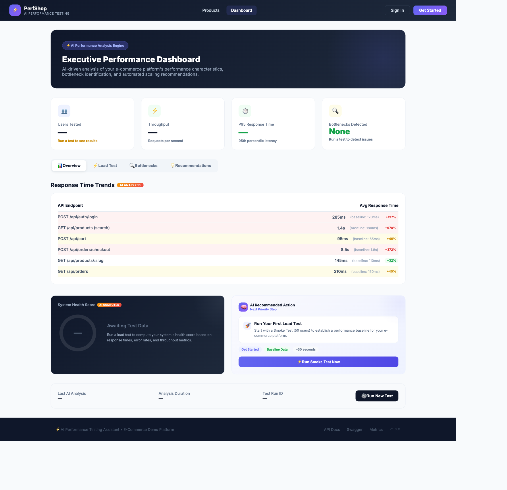
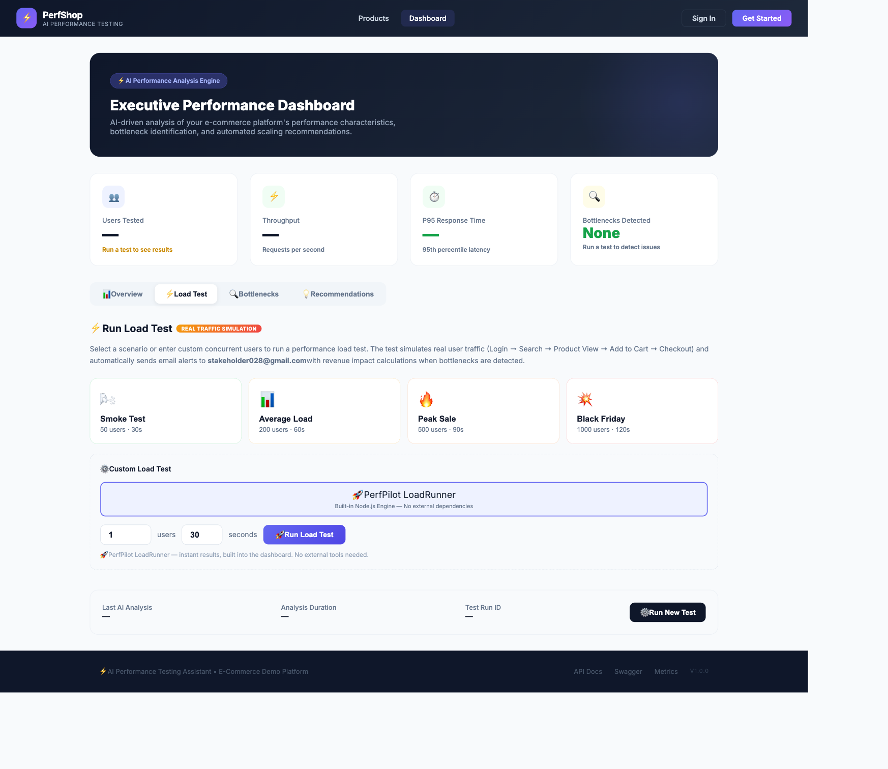
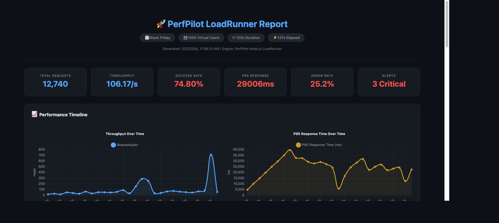
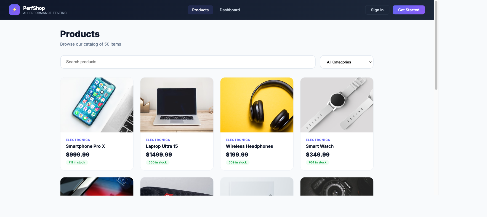

# PerfPilot AI — AI Performance Testing Assistant

> An AI-powered performance testing platform that runs load tests, detects bottlenecks, computes health scores, and sends real-time email alerts with revenue impact analysis — all from a single dashboard. Zero external dependencies.


**Live Demo:** [https://perfpilot-ai.onrender.com](https://perfpilot-ai.onrender.com)

---

## What It Does

PerfPilot AI is a full-stack e-commerce platform with an integrated AI performance testing engine. It simulates real user traffic (Login, Search, Product View, Add to Cart, Checkout) and provides:

- **Built-in Load Testing** — Run tests directly from the dashboard with no external tools needed
- **AI Bottleneck Detection** — Automatically identifies response time degradation, error rate spikes, and throughput issues
- **System Health Score** — A single 0-100 score computed from response time, error rate, and throughput
- **Smart Recommendations** — AI-generated next-action suggestions based on test results
- **Email Alerts** — Single combined SendGrid email per test run with all findings and revenue impact
- **Interactive HTML Reports** — Animated charts with response time trends, endpoint breakdown, and error timeline (viewable and downloadable)

---

## Screenshots

### Executive Dashboard
KPI cards, health score, AI recommendations, and load test controls.



### Load Testing
Preset scenarios (Smoke, Average, Peak, Black Friday) or custom user/duration configuration.



### LoadRunner HTML Report
Interactive animated report with Chart.js — response time percentiles, throughput timeline, endpoint breakdown, error distribution.



### Products Page
50 products across 6 categories with search, filtering, and real images.



---

## Quick Start

```bash
# Clone
git clone https://github.com/prudhvi-battu/PERFPILOT-AI.git
cd PERFPILOT-AI

# Install all dependencies and build frontend
npm run build

# Start (serves both API and React frontend)
npm start
```

Open [http://localhost:5000](http://localhost:5000)

### Test Accounts

| Role     | Email               | Password    |
|----------|---------------------|-------------|
| Admin    | admin@shop.com      | password123 |
| Customer | john@example.com    | password123 |

> Admin access is required to run load tests from the Dashboard.

---

## Running Load Tests

### From Dashboard (Recommended)

1. Login as `admin@shop.com`
2. Go to **Dashboard > Load Test** tab
3. Click a preset scenario or set custom users/duration
4. Results appear in real-time with:
   - Health score calculation
   - Bottleneck detection and findings
   - Combined email alert sent to configured address
   - "View Interactive Report" and "Download HTML" buttons

### From CLI

```bash
# Quick test (10 users, 15 seconds)
USERS=10 DURATION_MS=15000 node performance-tests/load_test_runner.js
```

---

## Project Structure

```
├── frontend/                    # React 18 SPA
│   ├── src/pages/               # Products, Cart, Orders, Dashboard, Admin
│   ├── src/components/          # Navbar, Footer, ProtectedRoute
│   ├── src/context/             # Auth context (JWT)
│   ├── src/hooks/               # useLoadTest hook
│   └── src/services/            # Axios API layer
│
├── backend/                     # Node.js + Express API
│   ├── routes/                  # auth, products, cart, orders, admin, alerts, loadtest
│   ├── middleware/              # auth (JWT), metrics (Prometheus), error handler
│   ├── services/                # alertEngine, notificationService, sendgridSender
│   ├── server.js                # Entry point (serves React build in production)
│   └── db.js                    # SQLite via sql.js
│
├── performance-tests/
│   └── load_test_runner.js      # Built-in Node.js load test engine
│
├── data/                        # SQLite database (pre-seeded)
├── reports/                     # Generated HTML reports (runtime)
├── screenshots/                 # README images
├── prometheus/                  # Prometheus config (for Docker)
├── grafana-dashboard/           # Grafana dashboard (for Docker)
├── docker-compose.yml           # Full stack with Prometheus + Grafana
├── render.yaml                  # Render.com deployment blueprint
└── package.json                 # Root scripts (build, start)
```

---

## Technology Stack

| Layer | Technology |
|-------|-----------|
| Frontend | React 18, React Router 6, Axios |
| Backend | Node.js 18+, Express 4, sql.js (SQLite) |
| Load Testing | Built-in Node.js LoadRunner (no external tools) |
| AI Engine | Custom bottleneck detection + health scoring |
| Reports | Chart.js animated HTML (viewable + downloadable) |
| Email Alerts | SendGrid API (combined alert per test run) |
| Monitoring | Prometheus metrics endpoint |
| API Docs | Swagger/OpenAPI 3.0 (live at /api-docs) |
| Deployment | Render.com (single service) or Docker Compose |

---

## API Endpoints

| Endpoint | Method | Description |
|----------|--------|-------------|
| /api/auth/login | POST | User authentication (JWT) |
| /api/auth/register | POST | User registration |
| /api/products | GET | Product listing with search/filter/pagination |
| /api/products/:slug | GET | Product detail |
| /api/cart | GET/POST | View/add to cart |
| /api/orders | GET/POST | Order history / checkout |
| /api/loadtest/run | POST | Run a load test |
| /api/loadtest/status | GET | Poll test status |
| /api/loadtest/report | GET | View HTML report |
| /api/loadtest/report/download | GET | Download HTML report |
| /api/alerts/status | GET | Alert engine status |
| /api/alerts/test | POST | Send test email |
| /api/health | GET | Health check |
| /api/metrics | GET | Prometheus metrics |
| /api-docs | GET | Swagger UI |

---

## Email Alerts

When a load test detects performance issues, a single combined email is sent via SendGrid containing:
- Test summary (scenario, users, success rate, P95, throughput)
- All findings with severity, metric values, and thresholds
- Revenue impact per finding
- Top 3 recommended actions per issue

**Configuration** (`backend/.env`):
```
SENDGRID_API_KEY=SG.xxxxx
ALERT_EMAIL_TO=stakeholder028@gmail.com
ALERT_FROM_EMAIL=stakeholder028@gmail.com
```

---

## Deployment

### Render.com

Deploys as a single web service — backend serves the React build.

```
Build Command: npm run build
Start Command: npm start
```

Set environment variables in Render dashboard:
- `NODE_ENV=production`
- `JWT_SECRET=<random>`
- `SENDGRID_API_KEY=<key>`
- `ALERT_EMAIL_TO=<email>`
- `ALERT_FROM_EMAIL=<email>`

### Docker Compose

```bash
docker-compose up -d
# Starts: Backend + Frontend, Prometheus, Grafana
```

---

## Security

- Passwords hashed with bcrypt (10 rounds)
- JWT authentication with 24h expiry
- Rate limiting (10,000 req/min)
- Helmet security headers
- Parameterized SQL queries
- Admin-only access for load testing

---

<p align="center">
  PerfPilot AI — Built for the future of performance engineering
</p>
