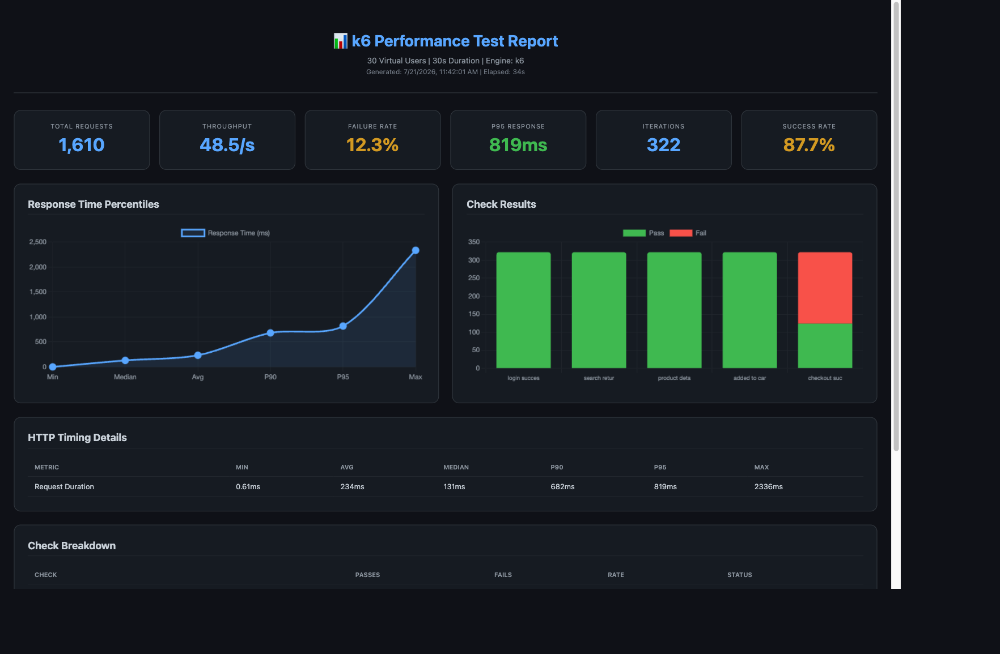
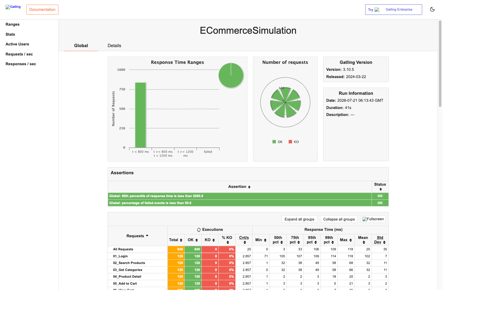

# ⚡ PerfPilot AI — AI Performance Testing Assistant

> An AI-powered performance testing platform that runs load tests, detects bottlenecks, computes health scores, and sends real-time email alerts with revenue impact analysis — all from a single dashboard.


**Live Demo:** [https://perfpilot-ai.onrender.com](https://perfpilot-ai.onrender.com)

---

## 🎯 What It Does

PerfPilot AI is a full-stack e-commerce platform with an integrated AI performance testing engine. It simulates real user traffic (Login → Search → Product View → Add to Cart → Checkout) and provides:

1. **Multi-Engine Load Testing** — Run tests with Node (built-in), k6, or Gatling from the dashboard
2. **AI Bottleneck Detection** — Automatically identifies response time degradation, error rate spikes, and throughput issues
3. **System Health Score** — A single 0-100 score computed from response time, error rate, and throughput metrics
4. **Smart Recommendations** — AI-generated next-action suggestions based on test results
5. **Email Alerts** — Real-time SendGrid notifications with revenue impact calculations when bottlenecks are detected
6. **Interactive Reports** — k6 and Gatling generate downloadable HTML reports with charts

## Screenshots

### Products Page
Browse 50 products with real images across 6 categories, with search and filtering.


### Executive Dashboard
KPI cards, response time trends with baseline comparison, and AI-analyzed performance metrics.


### Load Testing
Run tests with Node, k6, or Gatling. Preset scenarios or custom configuration with real-time progress.


### k6 Performance Report
Interactive HTML report with response time percentiles, check results, and HTTP timing breakdown.



### Gatling Simulation Report
Enterprise-grade report with response time ranges, request breakdown, and assertions.



---

## 🏗️ Project Structure

```
├── frontend/                    # React 18 SPA
│   ├── src/
│   │   ├── pages/               # Products, Cart, Orders, Dashboard, Admin
│   │   ├── components/          # Navbar, Footer, ProtectedRoute
│   │   ├── context/             # Auth context (JWT)
│   │   ├── hooks/               # useLoadTest (shared load test hook)
│   │   └── services/            # Axios API layer
│   └── public/
│
├── backend/                     # Node.js + Express API
│   ├── routes/                  # auth, products, cart, orders, admin, alerts, loadtest
│   ├── middleware/              # auth (JWT), metrics (Prometheus), error handler
│   ├── services/                # alertEngine, notificationService, sendgridSender
│   ├── server.js                # Express entry (serves React build in production)
│   └── db.js                    # SQLite via sql.js (in-memory with file persistence)
│
├── performance-tests/
│   ├── k6/                      # k6 load test scripts (smoke, average, peak, black friday)
│   ├── gatling/                 # Gatling simulation (ECommerceSimulation.scala)
│   └── load_test_runner.js      # Built-in Node load test engine
│
├── ai-orchestrator/             # Standalone AI analysis CLI tool
├── prometheus/                  # Prometheus scraping config
├── grafana-dashboard/           # Grafana dashboard JSON provisioning
├── data/                        # SQLite database (pre-seeded with 50 products)
├── reports/                     # Generated test reports (k6 HTML, Gatling HTML)
├── docs/                        # Architecture & deployment documentation
├── docker-compose.yml           # Full stack orchestration
├── render.yaml                  # Render.com deployment blueprint
└── package.json                 # Root build/start scripts
```

## 🚀 Quick Start

### Local Development

```bash
# 1. Clone the repo
git clone https://github.com/prudhvi-battu/PERFPILOT-AI.git
cd PERFPILOT-AI

# 2. Install all dependencies and build frontend
npm run build

# 3. Start the server (serves both API and frontend)
npm start
```

Open [http://localhost:5000](http://localhost:5000) — the app is ready.

### Test Accounts

| Role     | Email               | Password      |
|----------|---------------------|---------------|
| Admin    | admin@shop.com      | password123   |
| Customer | john@example.com    | password123   |

> Admin access is required to run load tests from the Executive Dashboard.

---

## 🧪 Running Load Tests

### From the Dashboard (Recommended)

1. Login as `admin@shop.com`
2. Go to **Dashboard → Load Test** tab
3. Click a preset scenario or configure custom users/duration
4. Results appear in real-time with bottleneck detection and email alerts

### From CLI (k6)

```bash
# Smoke Test (50 users, 30s)
k6 run performance-tests/k6/smoke_test.js

# Average Load (200 users, 60s)
k6 run performance-tests/k6/average_load_test.js

# Black Friday (1000 users, 120s)
k6 run performance-tests/k6/black_friday_test.js
```

### From CLI (Gatling)

Requires Java 11+ and Gatling 3.10.5 installed:
```bash
USERS=50 DURATION_SEC=30 gatling.sh --simulation simulations.ECommerceSimulation
```

---

## 🧠 AI Features

### System Health Score
A single 0-100 score computed from:
- **Response Time** (40%) — P95 latency scoring
- **Error Rate** (40%) — Success rate percentage
- **Throughput** (20%) — Requests per second per user

### Smart Recommendations
The AI recommends the next priority action based on test results:
- High error rate → "Migrate from SQLite to PostgreSQL"
- Slow P95 → "Add composite database indexes"
- Moderate latency → "Add Redis caching layer"
- System healthy → "Scale test to find breaking point"

### Real-Time Email Alerts
When bottlenecks are detected during a load test, SendGrid sends an email with:
- Alert severity and metric details
- Revenue impact calculation (estimated $/hour lost)
- Recommended remediation steps

---

## 🛠️ Technology Stack

| Layer | Technology |
|-------|-----------|
| Frontend | React 18, React Router 6, Axios, Recharts, Chart.js |
| Backend | Node.js 18+, Express 4, sql.js (SQLite) |
| Database | SQLite (in-memory with WAL persistence) |
| Load Testing | Built-in Node runner, k6 (Grafana), Gatling (JVM) |
| AI Engine | Custom bottleneck detection + health scoring |
| Email Alerts | SendGrid API |
| Monitoring | Prometheus metrics endpoint, Grafana dashboards |
| API Docs | Swagger/OpenAPI 3.0 (live at /api-docs) |
| Deployment | Render.com (single service), Docker Compose |
| Product Images | Unsplash (hotlinked, no storage needed) |

---

## 🌐 Deployment

### Render.com (Production)

The app deploys as a single web service — backend serves the React build.

```yaml
# render.yaml
Build Command: npm run build
Start Command: npm start
```

**Environment Variables (set in Render dashboard):**
```
NODE_ENV=production
JWT_SECRET=<random-secret>
SENDGRID_API_KEY=<your-sendgrid-key>
ALERT_EMAIL_TO=<your-email>
ALERT_FROM_EMAIL=<your-email>
```

### Docker Compose (Full Stack)

```bash
docker-compose up -d
```

Starts: Backend, Frontend, Prometheus, Grafana

---

## 📈 API Endpoints

| Endpoint | Method | Description |
|----------|--------|-------------|
| /api/auth/login | POST | User authentication (returns JWT) |
| /api/auth/register | POST | User registration |
| /api/products | GET | Product listing with search/filter/pagination |
| /api/products/:slug | GET | Product detail + related products |
| /api/cart | GET/POST | View/add to cart |
| /api/orders | GET/POST | Order history / checkout |
| /api/admin/stats | GET | Admin dashboard statistics |
| /api/loadtest/run | POST | Trigger Node load test |
| /api/loadtest/run-k6 | POST | Trigger k6 load test |
| /api/loadtest/run-gatling | POST | Trigger Gatling load test |
| /api/loadtest/status | GET | Poll test status |
| /api/loadtest/report/k6 | GET | View k6 HTML report |
| /api/loadtest/report/gatling | GET | View Gatling HTML report |
| /api/alerts/stream | GET | SSE stream for real-time alerts |
| /api/health | GET | Health check |
| /api/metrics | GET | Prometheus metrics |
| /api-docs | GET | Swagger UI |

---

## 🔐 Security

- Passwords hashed with bcrypt (10 salt rounds)
- JWT authentication with configurable expiry
- Rate limiting (10,000 req/min, status endpoints exempt)
- Helmet security headers
- CORS configured for all origins (demo mode)
- Parameterized SQL queries (no injection)
- Admin-only access for load testing and admin routes

---

## 📂 Key Files

| File | Purpose |
|------|---------|
| `backend/server.js` | Express server, auto-migration, auto-seed, static serving |
| `backend/services/alertEngine.js` | AI alert detection with thresholds and email notifications |
| `backend/routes/loadtest.js` | Load test orchestration (Node, k6, Gatling) |
| `frontend/src/pages/ExecutiveDashboard.js` | Main dashboard with health score, KPIs, load testing |
| `performance-tests/load_test_runner.js` | Built-in Node.js load test engine |
| `performance-tests/k6/smoke_test.js` | k6 smoke test script |
| `performance-tests/gatling/ECommerceSimulation.scala` | Gatling simulation |

---

<p align="center">
  ⚡ PerfPilot AI — Built for the future of performance engineering
</p>
